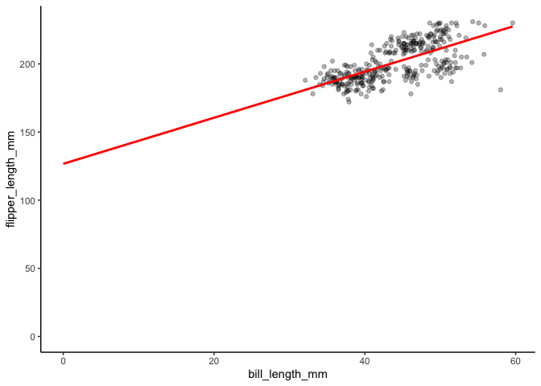
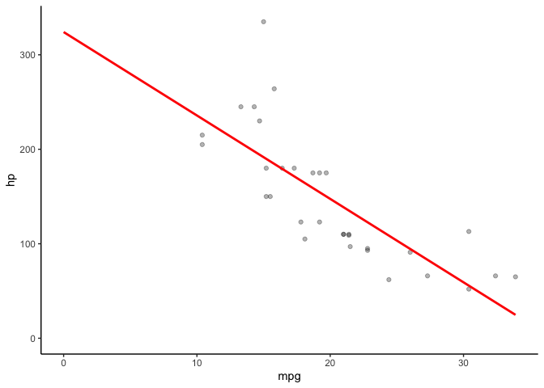

<!-- README.md is generated from README.Rmd. Please edit that file -->

# quickplot

<!-- badges: start -->
<!-- badges: end -->

The goal of quickplot is to produce a quick plot of two numeric
variables. Three parameters are required; data, x, and y. The graph that
is produced places the x parameter on the x-axis, and the y parameter on
the y-axis. These variables are determined based on the dataframe that
is defined as the data parameter.

## Installation

quickplot is not yet on CRAN. But, you can download it from this
repository using the following R command:

``` r
devtools::install_github("Kyle-Amaral/quickplot")
```

## Example

This is a basic example which shows you how to solve a common problem:

``` r
library(quickplot)
scatter_graph(palmerpenguins::penguins, bill_length_mm, flipper_length_mm)
#> `geom_smooth()` using formula 'y ~ x'
#> Warning: Removed 2 rows containing non-finite values (stat_smooth).
#> Warning: Removed 2 rows containing missing values (geom_point).
```



This package is special because it produces a scatterplot that can be
used to see preliminary trends between two numerical variables. All it
requires is the dataframe and the two numerical variables of interest.
It will also make sure that only numerical variables are being used and
will let you know why the function is not working (ie. inputted a factor
variable instead of numerical).

``` r
library(quickplot)
scatter_graph(mtcars, mpg, hp)
#> `geom_smooth()` using formula 'y ~ x'
```


